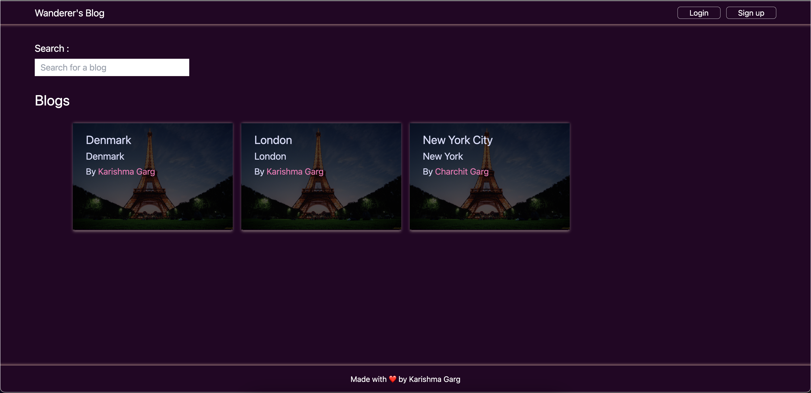

# Wanderer's Blog

## Table of contents

- [Overview](#overview)
  - [The challenge](#the-challenge)
  - [Screenshot](#screenshot)
  - [Links](#links)
- [My process](#my-process)
  - [Built with](#built-with)
- [Author](#author)

## Overview

### The challenge

Users should be able to:

- View the optimal layout depending on their device's screen size
- See hover states for interactive elements
- See other user's travel articles
- Register and Login to the site
- Reset Password
- Publish travel articles
- Delete Account
- Delete any of your own articles

### Screenshot

### Links

- Solution URL: [https://github.com/krrish105/wanderers-blog](https://github.com/krrish105/wanderers-blog)
- Live Site URL: [https://wanderers-blog.netlify.app](https://wanderers-blog.netlify.app)

## My process

### Built with

- Front-End:

  - Mobile-first workflow
  - Semantic HTML5 markup
  - CSS custom properties
  - Flexbox, CSS Grid
  - [React](https://reactjs.org/) - JS library
  - [Tailwind CSS](https://styled-components.com/) - For styles

- Back-End:
  - [MongoDB](https://www.mongodb.com/)
  - [Express.js](https://expressjs.com/)
  - [Nodemailer](https://nodemailer.com/about/)
  - [Node.js](https://nodejs.org/en/)
  - [JSON Web Token](https://jwt.io/)
  - [Mongoose](https://mongoosejs.com/)

## Author

- Frontend Mentor - [Krrish105](https://www.frontendmentor.io/profile/Krrish105)
- Twitter - [@\_karishma10](https://twitter.com/_karishma10)
- LinkedIn - [Karishma Garg](https://www.linkedin.com/in/karishma-garg-)
- CodePen - [Krrish105](https://codepen.io/krrish105)
